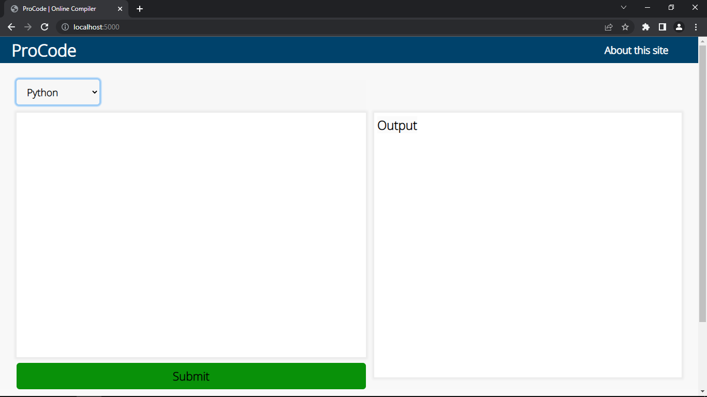

# online-compiler

This Compiler supports C, C++, Python, Javascript languages
To run use this compiler on your local machine follow below steps
**Use git bash or linux terminal for better experience**

1) **_npm install_**
2) **_npm run devstart_**
3) **_goto localhost on port 5000_**
